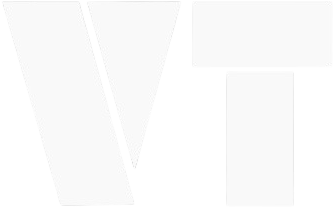

<h1 align="center">  >Hi Devs👋, I'mm Victor Theodoro!</h1>
<h3 align="center">A General Technology Professional From Brazil</h3>

  

  

<h3 align="left">Connect with me:</h3>

<h3 align="left">Languages and Tools:</h3>

                   

&nbsp;

