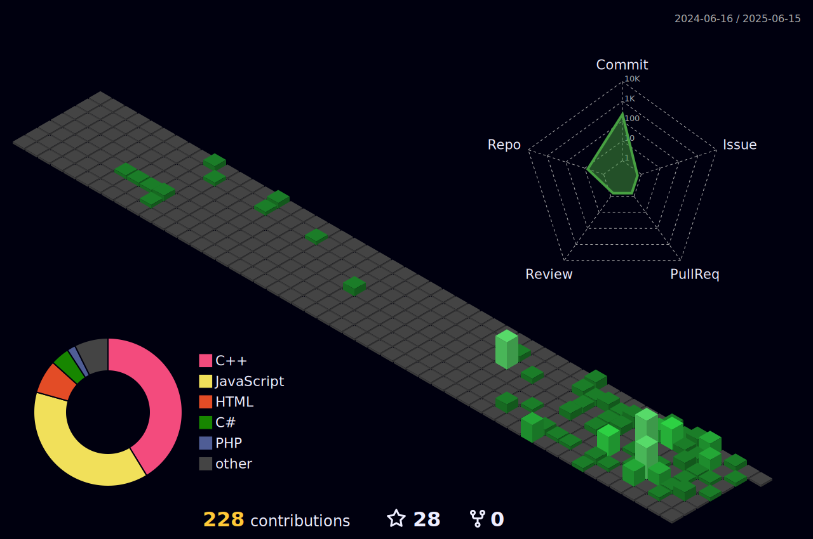

<h1>About Me:</h1>
    <h3>Currently as CEO of Print 3D - 3d Printing</h3>
    <ul>
        <li>
            <strong>📚 Currently Pursuing:</strong>
            <ul>
                <li>🖥️ Systems Development (In tandem with High School)</li>
                <li>🎮 Fullstack Game Development</li>
            </ul>
        </li>
        <li>
            <strong>🌐 Main Experiences:</strong>
            <ul>
                <li>🌐 Technology Enthusiast</li>
                <li>👨‍💻 Programmer</li>
                <li>🖨️ 3D Printing Specialist</li>
                <li>⚡ Electrical & Electronics Enthusiast</li>
                <li>🎥 Audiovisual Enthusiast</li>
            </ul>
        </li>
    </ul>

    
  

  
<h3>Currently Learning and Diving Into...</h3>

<h3>Experience with...</h3>

 
 

<h3>Currently Using Platforms...</h3>

<h4>Also Using...</h4>

 

